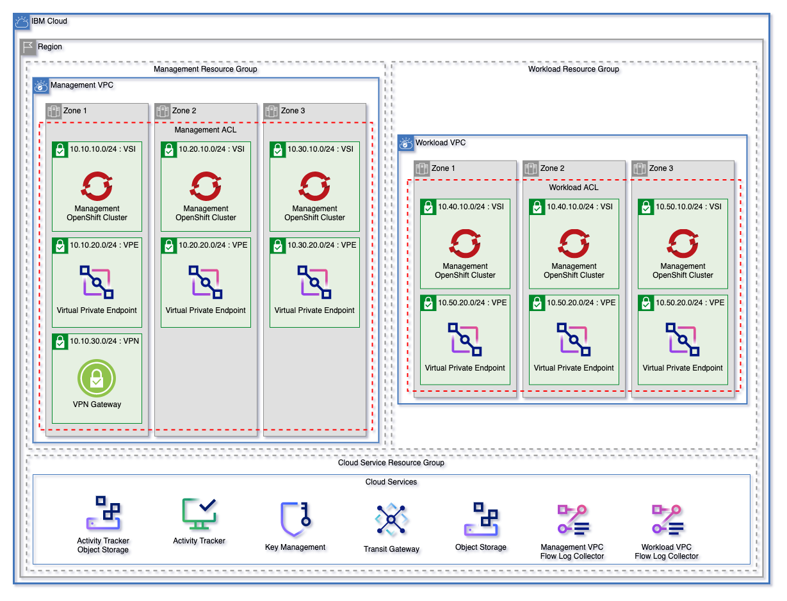

# IBM Secure Landing Zone

## Table of Contents

1. [Prerequisites](#prerequisites)
    1. [Setting Up an IBM Cloud Account](#setting-up-an-ibm-cloud-account)
    2. [Setup IBM Cloud Account for Secure Landing Zone](#setup-ibm-cloud-account-for-secure-landing-zone)
    3. [Setup Account Access (Cloud IAM)](#setup-account-access-cloud-iam)
    4. [Repository Authorization](#repository-authorization)
    5. [(Optional) Setting Up Hyper Protect Crypto Services](#optional-setting-up-hyper-protect-crypto-services)
2. [Patterns](#patterns)
---

## Prerequisites

To ensure that Secure Landing Zone can be deployed, esure that the following steps have been completed before deployment.

---

### Setting Up an IBM Cloud Account

An IBM Cloud account is required. An Enterprise account is recommended but Pay as you Go account suffices to deploy secure landing zone cloud resources. 

If you do not already have an account, follow instructions [to create the account](https://cloud.ibm.com/docs/account?topic=account-account-getting-started#account-gs-createlite) and [upgrade to Pay-as-you-Go](https://cloud.ibm.com/docs/account?topic=account-account-getting-started#account-gs-upgrade)

- Have access to an [IBM Cloud account](https://cloud.ibm.com/docs/account?topic=account-account-getting-started). An Enterprise account is recommended but a Pay as you Go account should also work with this automation.

---

### Setup IBM Cloud Account for Secure Landing Zone

1. Log into IBM Cloud [console](https://cloud.ibm.com) using the IBMid you used to setup the account. This IBMid user is the account __owner__ and has all the IAM accesses.

2. [Complete the company profile and contacts information](https://cloud.ibm.com/docs/account?topic=account-contact-info) for the account. This is required to stay in compliance with IBM Cloud Financial Service profile.

3. [Enable the flag](https://cloud.ibm.com/docs/account?topic=account-enabling-fs-validated) to designate your IBM Cloud account to be Financial Services Validated.

4. Enable VRF and Service Endpoints. This requires creating a support case. Follow [instructions](https://cloud.ibm.com/docs/account?topic=account-vrf-service-endpoint#vrf) carefully.

---

### Setup Account Access (Cloud IAM)

1. [Create an IBM Cloud API Key](https://cloud.ibm.com/docs/account?topic=account-userapikey#create_user_key). User owning this key should be part of __admins__ group. **Necessary if manually provisioning**

2. [Setup MFA for all IBM Cloud IAM users](https://cloud.ibm.com/docs/account?topic=account-account-getting-started#account-gs-mfa).

3. [Setup Cloud IAM Access Groups](https://cloud.ibm.com/docs/account?topic=account-account-getting-started#account-gs-accessgroups). User access to cloud resources will be controlled using the Access Policies assigned to Access Groups. IBM Cloud Financial Services profile requires that all IAM users do not get assigned any accesses directly to any cloud resources. When assigning Access policies, Click "All Identity Access Enabled Services" from drop down menu.

---

### (Optional) Setting Up Hyper Protect Crypto Services

For Key Management services, user can optionally use Hyper Protect Crypto Services. This instance will need to be created before creating the Secure Landing Zone.

#### Hyper Crypto Service and Initialization

##### Creating HPCS Using the IBM Cloud CLI

To provision an instance of Hyper Protect Crypto Services IBM Cloud Console, complete the following steps:

1. Log in to your [IBM Cloud account](https://cloud.ibm.com).
2. Click Catalog to view the list of services that are available on IBM Cloud.
3. From the Catalog navigation pane, click Services. And then, under Category, select Security.
4. From the list of services displayed, click the Hyper Protect Crypto Services tile.
5. On the service page, select the pricing plan of choice.
6. Fill in the form with the details that are required.

##### Initializing HPCS

To initialize the provisioned Hyper Protect Crypto Service instance, we recommend to follow the product docs to perform the quick initialization.  

[Hyper Protect Cyrpto Service Documentation](https://cloud.ibm.com/docs/hs-crypto?topic=hs-crypto-get-started)

For proof of technology environments we recommend using the `auto-init` feature. [Auto Init Documentation](https://cloud.ibm.com/docs/hs-crypto?topic=hs-crypto-initialize-hsm-recovery-crypto-unit)  

-----

### Repository Authorization

The toolchain requires authorization to access your repository.  If it does not have access, the toolchain will request that you authorize access.  Below shows you how you can create a personal access token for your repository

- [GitHub and GitHub Enterprise](https://docs.github.com/en/authentication/keeping-your-account-and-data-secure/creating-a-personal-access-token)
- [GitLab](https://docs.gitlab.com/ee/user/profile/personal_access_tokens.html)
- [Bitbucket](https://confluence.atlassian.com/bitbucketserver/personal-access-tokens-939515499.html)

You can manager your authorizations via [Manage Git Authorizations](https://cloud.ibm.com/devops/git)

---

## Patterns

### Virtual Server Pattern

### Red Hat OpenShift Pattern

### Mixed Pattern

