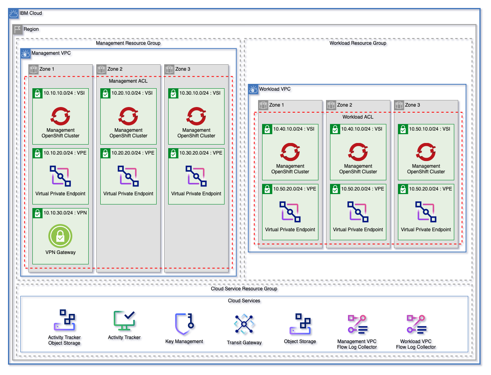

# Landing Zone Mixed Pattern 

This template allows a user to create a landing zone



## Module Variables

Name                     | Type         | Description                                                                                                                                                                                                                                                                                                                                                                                                                                                                                                                                                                  | Sensitive | Default
------------------------ | ------------ | ---------------------------------------------------------------------------------------------------------------------------------------------------------------------------------------------------------------------------------------------------------------------------------------------------------------------------------------------------------------------------------------------------------------------------------------------------------------------------------------------------------------------------------------------------------------------------- | --------- | --------------------------
ibmcloud_api_key         | string       | The IBM Cloud platform API key needed to deploy IAM enabled resources.                                                                                                                                                                                                                                                                                                                                                                                                                                                                                                       | true      | 
TF_VERSION               | string       | The version of the Terraform engine that's used in the Schematics workspace.                                                                                                                                                                                                                                                                                                                                                                                                                                                                                                 |           | 1.0
prefix                   | string       | A unique identifier for resources. Must begin with a letter and end with a letter or number. This prefix will be prepended to any resources provisioned by this template. Prefixes must be 16 or fewer characters.                                                                                                                                                                                                                                                                                                                                                           |           | 
region                   | string       | Region where VPC will be created. To find your VPC region, use `ibmcloud is regions` command to find available regions.                                                                                                                                                                                                                                                                                                                                                                                                                                                      |           | 
tags                     | list(string) | List of tags to apply to resources created by this module.                                                                                                                                                                                                                                                                                                                                                                                                                                                                                                                   |           | []
network_cidr             | string       | Network CIDR for the VPC. This is used to manage network ACL rules for cluster provisioning.                                                                                                                                                                                                                                                                                                                                                                                                                                                                                 |           | 10.0.0.0/8
vpcs                     | list(string) | List of VPCs to create. The first VPC in this list will always be considered the `management` VPC, and will be where the VPN Gateway is connected. VPCs names can only be a maximum of 16 characters and can only contain letters, numbers, and - characters. VPC names must begin with a letter.. The first VPC in this list will always be considered the `management` VPC, and will be where the VPN Gateway is connected. VPCs names can only be a maximum of 16 characters and can only contain letters, numbers, and - characters. VPC names must begin with a letter. |           | ["managemnet", "workload"]
enable_transit_gateway   | bool         | Create transit gateway                                                                                                                                                                                                                                                                                                                                                                                                                                                                                                                                                       |           | true
add_atracker_route       | bool         | Atracker can only have one route per zone. Use this value to disable or enable the creation of atracker route                                                                                                                                                                                                                                                                                                                                                                                                                                                                 |           | true
hs_crypto_instance_name  | string       | Optionally, you can bring you own Hyper Protect Crypto Service instance for key management. If you would like to use that instance, add the name here. Otherwise, leave as null                                                                                                                                                                                                                                                                                                                                                                                              |           | null
hs_crypto_resource_group | string       | If you're using Hyper Protect Crypto services in a resource group other than `Default`, provide the name here.                                                                                                                                                                                                                                                                                                                                                                                                                                                               |           | null
cluster_zones            | number       | Number of zones to provision clusters for each VPC. At least one zone is required. Can be 1, 2, or 3 zones.                                                                                                                                                                                                                                                                                                                                                                                                                                                                  |           | 3
kube_version             | string       | Kubernetes version to use for cluster. To get available versions, use the IBM Cloud CLI command `ibmcloud ks versions`. To use the default version, leave as default. Updates to the default versions may force this to change.                                                                                                                                                                                                                                                                                                                                              |           | default
flavor                   | string       | Machine type for cluster. Use the IBM Cloud CLI command `ibmcloud ks flavors` to find valid machine types                                                                                                                                                                                                                                                                                                                                                                                                                                                                    |           | bx2.16x64
workers_per_zone         | number       | Number of workers in each zone of the cluster. OpenShift requires at least 2 workers.                                                                                                                                                                                                                                                                                                                                                                                                                                                                                        |           | 1
wait_till                | string       | To avoid long wait times when you run your Terraform code, you can specify the stage when you want Terraform to mark the cluster resource creation as completed. Depending on what stage you choose, the cluster creation might not be fully completed and continues to run in the background. However, your Terraform code can continue to run without waiting for the cluster to be fully created. Supported args are `MasterNodeReady`, `OneWorkerNodeReady`, and `IngressReady`                                                                                          |           | IngressReady
update_all_workers       | bool         | Update all workers to new kube version                                                                                                                                                                                                                                                                                                                                                                                                                                                                                                                                       |           | false
entitlement              | string       | If you do not have an entitlement, leave as null. Entitlement reduces additional OCP Licence cost in OpenShift clusters. Use Cloud Pak with OCP Licence entitlement to create the OpenShift cluster. Note It is set only when the first time creation of the cluster, further modifications are not impacted Set this argument to cloud_pak only if you use the cluster with a Cloud Pak that has an OpenShift entitlement.                                                                                                                                                  |           | null
override                 | bool         | Override default values with custom JSON template. This uses the file `override.json` to allow users to create a fully customized environment.                                                                                                                                                                                                                                                                                                                                                                                                                               |           | false

## Using override.json

To create a fully customized environment based on the starting template, users can use [override.json](./override.json) by setting the template `override` variable to `true`.

### Variable Definitions

By using the variable deifnitions found in our [landing zone module](../../landing-zone/) any number and custom configuration of VPC components, VSI workoads, and clusters can be created. Currently `override.json` is set to contain the default environment configuration.

### Getting Your Environment

This module outputs `config`, a JSON encoded definition of your environment based on the defaults for Landing Zone and any variables changed using `override.json`. By using this output, it's easy to configure multiple additional workloads, VPCs, or subnets in existing VPCs to the default environment.

### Overriding Only Some Variables

`override.json` does not need to contain all elements. As an example override.json could be:
```json
{
    "enable_transit_gateway": false
}
```

In this use case, each other value would be the default configuration, just with a transit gateway disabled.

# Technical Docs go here

# Technical Docs go here